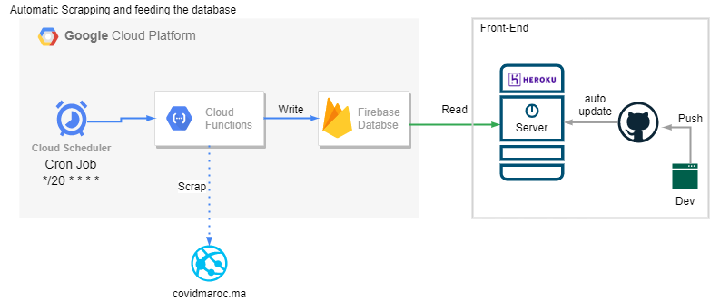

# Dash
Current Demo is here : [url](https://polar-refuge-68443.herokuapp.com/)


 
# Structure



the conf.json for cloud function not included (only read-only.json) 
## Getting Started

### Deploy this app to your account


[](https://heroku.com/deploy)

### Or Run the app locally

First create a virtual environment with conda or venv inside a temp folder, then activate it.

```
virtualenv venv

# Windows
venv\Scripts\activate
# Or Linux
source venv/bin/activate

```

Clone the git repo, then install the requirements with pip

```

pip install -r requirements.txt

```

To run the app
Run the app

```

python index.py

```

## About the App

## Built With

- [Dash](https://dash.plot.ly/) - Main server and interactive components
- [Plotly Python](https://plot.ly/python/) - Used to create the interactive plots
- Google Cloud Function
- Purely Python 